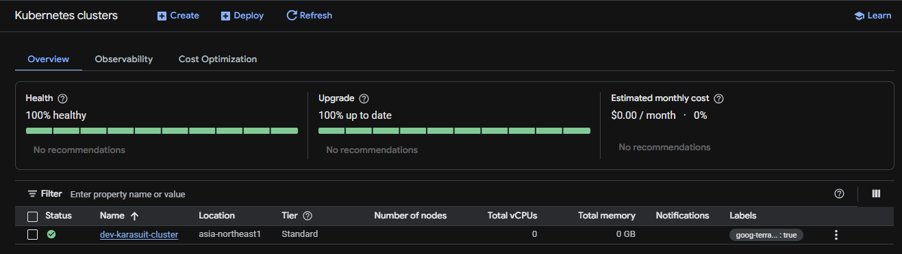
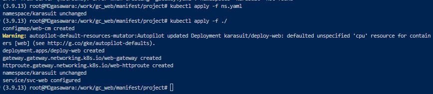
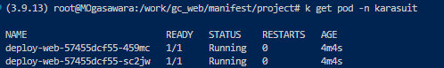
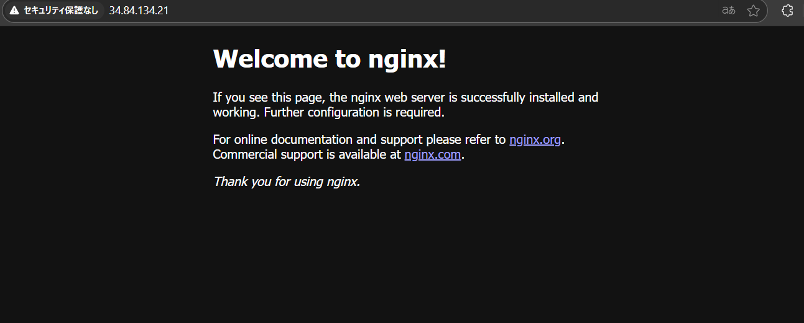

## フェーズ 1：GKE 上でコンテナを稼働させる。

### 概要

GoogleCloud 上の GKE にてクラスタを構築し、ローカル上で保有している manifest ファイルを使用して pod を作成する。

---

### 手順

#### 1. Terraform 用の tf ファイル群を作成

※本レポジトリの tree 構成は以下の通り

<pre><code>
├── Phase1.md
├── README.md
├── envs
│   └── dev
│       ├── backend.tf
│       ├── locals.tf(git管理対象外)
│       ├── main.tf
│       ├── outputs.tf
│       └── provider.tf
├── keys.json(git管理対象外)
├── manifest
│   └── project
│       ├── cm.yaml
│       ├── deploy-web.yaml
│       ├── gateway.yaml
│       ├── ns.yaml
│       └── svc.yaml
└── modules
    ├── gke
    │   ├── outputs.tf
    │   ├── project_cluster.tf
    │   └── variables.tf
    └── network
        ├── network.tf
        ├── outputs.tf
        └── variables.tf
</code></pre>

- state 状態を管理するため、Cloud Storage 上に格納する
- 今回は dev 環境のみの構築であるが、stg/prd 環境での構築を想定し、modules から呼び出す構成にしている

#### 2. terraform apply の実施

dev フォルダにカレントディレクトリを移動し、以下のコマンドで GoogleCloud 上にリソースを作成  
※GKE クラスタは GoogleCloud が推奨している Autopilot モードで構築

<pre><code>
terraform init
terraform plan
terraform apply --auto-approve
</code></pre>

#### 3. GKE クラスタの認証情報を取得

※google-cloud-cli-gke-gcloud-auth-plugin が未インストールであれば以下のコマンドを実施しておくこと

<pre><code>
sudo apt-get install google-cloud-cli-gke-gcloud-auth-plugin
</code></pre>

ローカル環境上で以下のコマンドを実施し、GKE 上で構築したクラスタへの認証情報を取得する

<pre><code>
gcloud container clusters get-credentials <クラスタ名> \
  --region <リージョン名> \
  --project <プロジェクトID>
</code></pre>

※上記コマンド実行により current-context の向き先が GKE になっていることを確認する

<pre><code>
kubectl config current-context
</code></pre>

#### 4. manifest ファイルから pod をデプロイ

manifest/project フォルダにカレントディレクトリを移動する

以下のコマンドを実行し、manifest ファイルを apply する

<pre><code>
kubectl apply -f ns.yaml
kubectl apply -f ./
※namespace作成前に後続が走るとエラーになるため、先んじてnamespace作成用のyamlを適用させている  
</code></pre>

以下のコマンドを実行し、pod が running になっていることを確認

<pre><code>
k get pod -n karasuit
</code></pre>

#### 5. pod への接続

以下のコマンドを実行し、svc-web サービスの EXTERNAL-IP の情報を取得する

<pre><code>
k get svc -n karasuit
</code></pre>

ブラウザを開き、http://[EXTERNAL-IP]を開き、nginx のデフォルト画面が表示されることを確認する

