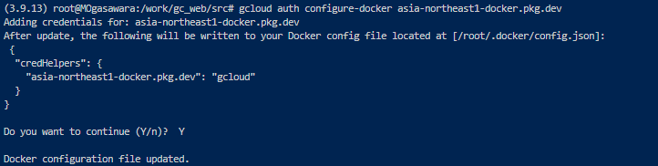
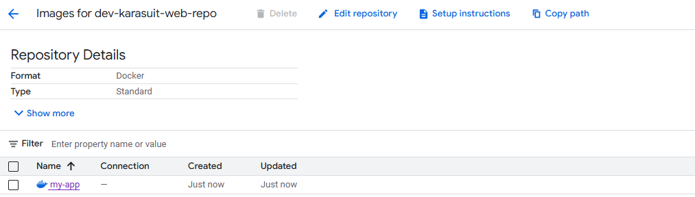
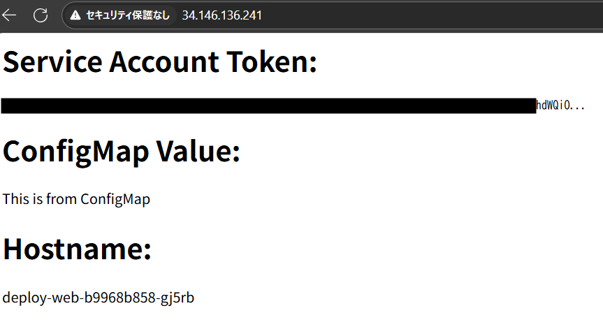

## フェーズ 2：コンテナイメージ準備+Artifact Registry からのイメージ取得

### 概要

Phase1 の環境で作成した Pod で使用するイメージを、Artifact Registry から Pull してデプロイされるようにする。

---

### 手順

#### 1. Terraform 用の tf ファイル群を作成

※本レポジトリの tree 構成は以下の通り

<pre><code>
├── README.md
├── envs
│   └── dev
│       ├── backend.tf
│       ├── locals.tf
│       ├── main.tf
│       ├── outputs.tf
│       └── provider.tf
├── keys.json
├── manifest
│   └── project
│       ├── cm.yaml(NEW)
│       ├── deploy-web.yaml
│       ├── gateway.yaml
│       ├── ns.yaml
│       └── svc.yaml
├── modules
│   ├── artifactregistry(NEW)
│   │   ├── outputs.tf
│   │   ├── variables.tf
│   │   └── web_repo.tf
│   ├── gke
│   │   ├── outputs.tf
│   │   ├── project_cluster.tf
│   │   └── variables.tf
│   └── network
│       ├── network.tf
│       ├── outputs.tf
│       └── variables.tf
└── src(NEW)
    ├── Dockerfile
    └── app.py
</code></pre>

Articfact Registry へプッシュする用のイメージは src フォルダ配下の Dockerfile を使用しイメージをビルドして生成する  
※ブラウザで画面表示時に、ホスト名/Configmap の値/SA の情報を表示させるアプリを準備(ChatGPT で生成)

◆app.py  
※MY_CONFIG_VALUE 変数は ConfigMap により上書き

<pre><code>
from flask import Flask
import os

app = Flask(__name__)

@app.route('/')
def index():
    # SAのトークンファイルを読む（通常 /var/run/secrets/kubernetes.io/serviceaccount/token）
    try:
        with open("/var/run/secrets/kubernetes.io/serviceaccount/token", "r") as f:
            sa_token = f.read()
    except Exception as e:
        sa_token = f"Error reading token: {e}"

    # ConfigMapを環境変数やファイルから取得（例として環境変数）
    config_value = os.getenv("MY_CONFIG_VALUE", "Config not found")

    # ホスト名（Pod名やNode名）も取得してみる
    hostname = os.uname().nodename

    return f"""
    <h1>Service Account Token:</h1><pre>{sa_token[:100]}...</pre>

    <h1>ConfigMap Value:</h1>
{config_value}

    <h1>Hostname:</h1>
{hostname}

    """

if **name** == '**main**':
app.run(host='0.0.0.0', port=8080)
</code></pre>

◆Dockerfile

<pre><code>
FROM python:3.9-slim

WORKDIR /app

COPY app.py /app/app.py

RUN pip install flask

EXPOSE 8080

CMD ["python", "app.py"]
</code></pre>

#### 2. Artifact Registry 上の Docker レポジトリ認証

以下のコマンドを実行し、Arifact Registry のレポジトリ認証を済ませる

<pre><code>
gcloud auth configure-docker asia-northeast1-docker.pkg.dev
</code></pre>

#### 3. イメージビルド + Artifact registry への Push

以下のコマンドを実行し、ローカル上でイメージをビルドする

<pre><code>
docker build -t asia-northeast1-docker.pkg.dev/<プロジェクトID>/<レポジトリ名>/my-app:latest .
</code></pre>

以下のコマンドを実行し、Artifact registry へ Push する

<pre><code>
docker push asia-northeast1-docker.pkg.dev/<プロジェクトID>/<レポジトリ名>/my-app:latest
</code></pre>

コンソール上でイメージが格納されていることを確認する

#### 4. manifest ファイルから pod をデプロイ

manifest/project フォルダにカレントディレクトリを移動する

deploy-web.yaml の spec の内容を以下のように変更する

<pre><code>
      serviceAccountName: default
      containers:
        - image: <前段で追加したイメージのパス>
          imagePullPolicy: Always
          ports:
            - containerPort: 8080
          name: web
          resources: {}
          terminationMessagePath: /dev/termination-log
          terminationMessagePolicy: File
          env:
            - name: MY_CONFIG_VALUE
              valueFrom:
                configMapKeyRef:
                  name: web-cm
                  key: MY_CONFIG_VALUE
</code></pre>

svc.yaml の targetport を 8080 に変更する

以下のコマンドを実行し、manifest ファイルを apply する

<pre><code>
kubectl apply -f ns.yaml
kubectl apply -f ./
※namespace作成前に後続が走るとエラーになるため、先んじてnamespace作成用のyamlを適用させている  
</code></pre>

以下のコマンドを実行し、pod が running になっていることを確認

<pre><code>
k get pod -n karasuit
</code></pre>

#### 5. pod への接続

以下のコマンドを実行し、svc-web サービスの EXTERNAL-IP の情報を取得する

<pre><code>
k get svc -n karasuit
</code></pre>

ブラウザを開き、http://[EXTERNAL-IP]を開き、nginx のデフォルト画面が表示されることを確認する

