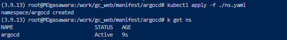
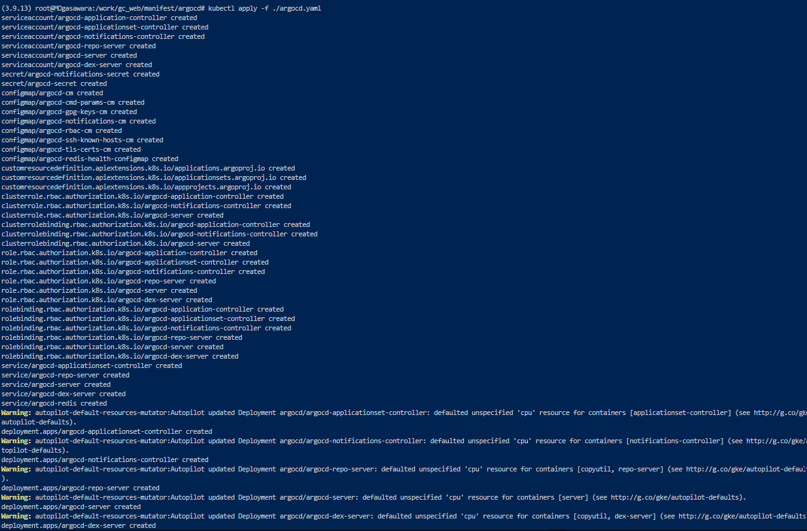
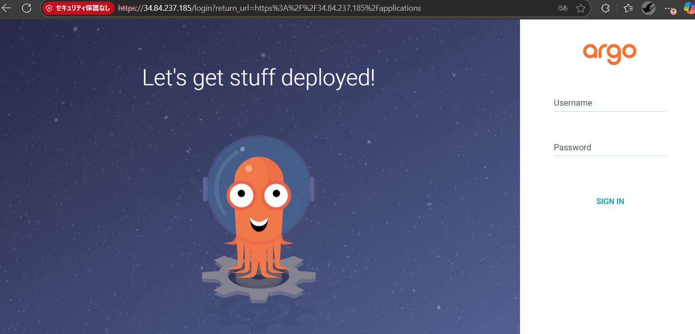
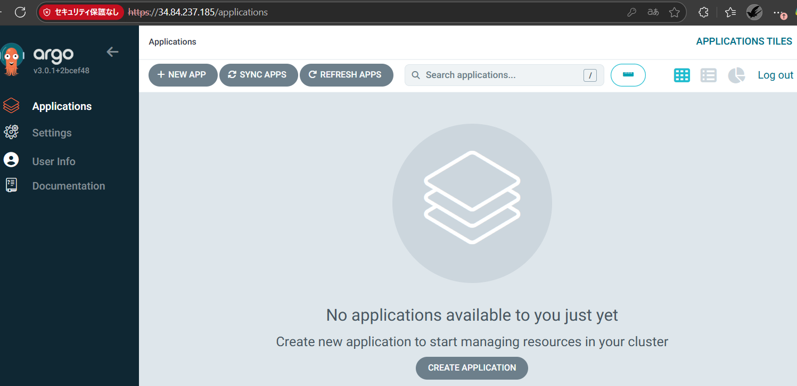
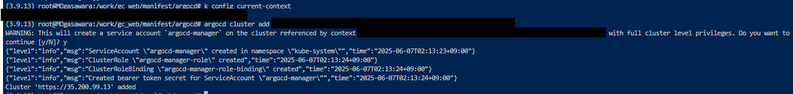
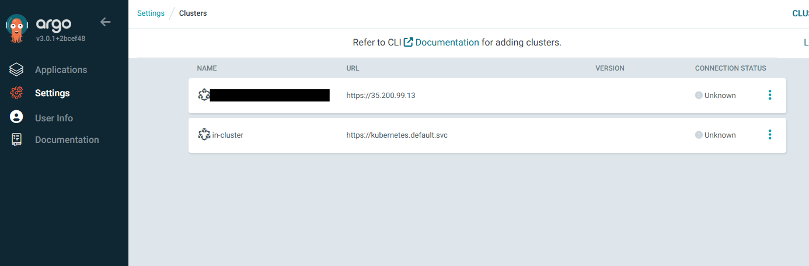

## フェーズ 3： ArgoCD の自動デプロイ

### 概要

Phase1,2 で構築したクラスタ環境とは別で ArgoCD をデプロイし、左記の環境を Github 上の manifest ファイル更新時に  
自動デプロイできる CD 環境を構築する。
※GKE の Autopilot モードの制約の都合上、ArgoCD のデプロイがかなり難しいため、Standard モードに変更する  
※ArgoCD にクラスタ登録時、kube-system NameSpace 上に ServiceAccount を作成できない仕様があるため  
※NodePool は、SSD のクオータ制約に引っかかるため HDD を使用

---

### 手順

#### 1. Terraform 用の tf ファイル群を作成

※本レポジトリの tree 構成は以下の通り

<pre><code>
.
├── README.md
├── envs
│   └── dev
│       ├── backend.tf
│       ├── locals.tf
│       ├── main.tf
│       ├── outputs.tf
│       └── provider.tf
├── keys.json
├── manifest
│   ├── argocd(NEW)
│   │   ├── argocd.yaml
│   │   └── ns.yaml
│   └── project
│       ├── cm.yaml
│       ├── deploy-web.yaml
│       ├── gateway.yaml
│       ├── ns.yaml
│       └── svc.yaml
├── modules
│   ├── artifactregistry
│   │   ├── outputs.tf
│   │   ├── variables.tf
│   │   └── web_repo.tf
│   ├── gke
│   │   ├── outputs.tf
│   │   ├── project_cluster.tf
│   │   └── variables.tf
│   └── network
│       ├── network.tf
│       ├── outputs.tf
│       └── variables.tf
└── src
    ├── Dockerfile
    └── app.py
</code></pre>

#### 2. ArgoCD 用の GKE クラスタを構築

ArgoCD 用のセカンダリー IP を構築する分の内容を tf ファイルに追記

◆modules/network/network.tf

<pre><code>
@@ -20,4 +20,12 @@ resource "google_compute_subnetwork" "private_subnet_gke_project" {
     range_name    = "${var.environment}-${var.project}-iprange-svc"
     ip_cidr_range = "192.168.10.0/24"
   }
+  secondary_ip_range {
+    range_name    = "${var.environment}-${var.project}-iprange-argopod"
+    ip_cidr_range = "192.168.20.0/24"
+  }
+  secondary_ip_range {
+    range_name    = "${var.environment}-${var.project}-iprange-argosvc"
+    ip_cidr_range = "192.168.30.0/24"
+  }
</code></pre>

ArgoCD 用の GKE クラスタおよび Web 用クラスタを Standard モードで作成  
VM 用の ServeciAccount も併せて作成

◆modules/gke/project_cluster.tf

<pre><code>
# GKEクラスタ (Standardモード)
resource "google_container_cluster" "cluster" {
  name     = "${var.environment}-${var.project}-cluster"
  location = var.gcp_region

  networking_mode = "VPC_NATIVE"
  network         = var.vpc_network
  subnetwork      = var.subnet_name

  ip_allocation_policy {
    cluster_secondary_range_name  = var.pod_range_name
    services_secondary_range_name = var.svc_range_name
  }

  deletion_protection      = false
  remove_default_node_pool = true
  initial_node_count       = 1
}

# Node Pool (Standardモードでノードを作成)
resource "google_container_node_pool" "node_pool" {
  name     = "${var.environment}-${var.project}-node-pool"
  location = var.gcp_region
  cluster  = google_container_cluster.cluster.name

  node_config {
    machine_type    = "e2-medium"
    disk_type       = "pd-standard"
    disk_size_gb    = 50
    image_type      = "COS_CONTAINERD"
    service_account = google_service_account.gke_node_sa.email
    oauth_scopes = [
      "https://www.googleapis.com/auth/cloud-platform",
    ]
    labels = {
      env = var.environment
    }
  }

  initial_node_count = 1
}

# argocdクラスタも同様にStandardモードにする場合
resource "google_container_cluster" "argocd" {
  name     = "${var.environment}-${var.project}-argocd"
  location = var.gcp_region

  networking_mode = "VPC_NATIVE"
  network         = var.vpc_network
  subnetwork      = var.subnet_name

  ip_allocation_policy {
    cluster_secondary_range_name  = var.argopod_range_name
    services_secondary_range_name = var.argosvc_range_name
  }

  deletion_protection      = false
  remove_default_node_pool = true
  initial_node_count       = 1
}

resource "google_container_node_pool" "argocd_node_pool" {
  name     = "${var.environment}-${var.project}-argocd-node-pool"
  location = var.gcp_region
  cluster  = google_container_cluster.argocd.name

  node_config {
    machine_type    = "e2-medium"
    disk_type       = "pd-standard"
    disk_size_gb    = 50
    image_type      = "COS_CONTAINERD"
    service_account = google_service_account.gke_node_sa.email
    oauth_scopes = [
      "https://www.googleapis.com/auth/cloud-platform",
    ]
    labels = {
      env = var.environment
    }
  }

  initial_node_count = 1
}

# Service Account(GKEノードのVM用)
resource "google_service_account" "gke_node_sa" {
  account_id   = "gke-node"
  display_name = "GKE Node Service Account"
}

resource "google_project_iam_member" "node_sa_roles" {
  project = var.id

  for_each = toset([
    "roles/container.nodeServiceAccount",
    "roles/logging.logWriter",
    "roles/monitoring.metricWriter",
  ])

  role   = each.key
  member = "serviceAccount:${google_service_account.gke_node_sa.email}"
}
</code></pre>

※output.tf/variables.tf/main.tf は適宜修正

以下のコマンドを実行し、GoogleCloud 環境に apply する

<pre><code>
terraform apply --auto-approve
</code></pre>

コンソール上で、セカンダリー IP および、ArgoCD 用のクラスタが構築されていることを確認する

#### 3. ArgoCD のデプロイ

manifest/argo フォルダにカレントディレクトリを移動する

helm コマンドで argocd のテンプレートを取得する

<pre><code>
helm repo approve argocd https://argoproj.github.io/argo-helm
helm repo update
helm template argocd argo/argo-cd --namespace argocd > argocd.yaml
</code></pre>

argocd のテンプレート内の argocd-server サービスの type を LoadBalancer に変更する

<pre><code>
# Source: argo-cd/templates/argocd-server/service.yaml
apiVersion: v1
kind: Service
metadata:
  name: argocd-server
  namespace: argocd
  labels:
    helm.sh/chart: argo-cd-8.0.4
    app.kubernetes.io/name: argocd-server
    app.kubernetes.io/instance: argocd
    app.kubernetes.io/component: server
    app.kubernetes.io/managed-by: Helm
    app.kubernetes.io/part-of: argocd
    app.kubernetes.io/version: "v3.0.1"
spec:
  type: LoadBalancer  ★変更
  sessionAffinity: None
  ports:
  - name: http
    protocol: TCP
    port: 80
    targetPort: 8080
  - name: https
    protocol: TCP
    port: 443
    targetPort: 8080
  selector:
    app.kubernetes.io/name: argocd-server
    app.kubernetes.io/instance: argocd
</code></pre>

argocd namespace を作成する yaml を作成する

<pre><code>
apiVersion: v1
kind: Namespace
metadata:
  name: argocd
</code></pre>

ローカル環境上で以下のコマンドを実施し、GKE 上で構築したクラスタへの認証情報を取得する

<pre><code>
gcloud container clusters get-credentials <クラスタ名(argocd)> \
  --region <リージョン名> \
  --project <プロジェクトID>
</code></pre>

※上記コマンド実行により current-context の向き先が GKE(argocd) になっていることを確認する

argocd namespace を作成する

<pre><code>
kubectl apply -f ./ns.yaml
</code></pre>

argocd をデプロイする

<pre><code>
kubectl apply -f ./argocd.yaml
</code></pre>

aegocd-server サービスの EXTERNAL-IP を確認し、ブラウザで ArgoCD の画面が表示されることを確認する

以下のコマンドを実行し、admin ユーザのパスワードを取得しコンソールからログインする

<pre><code>
kubectl -n argocd get secret argocd-initial-admin-secret \
  -o jsonpath="{.data.password}" | base64 -d
</code></pre>

以下のコマンドを実行し、コンソール上で ArgoCD サーバに接続する

<pre><code>
argocd login <argocd-serverのEXTERNAL-IP> --username admin --password <adminのユーザパスワード> --insecure
</code></pre>

Web 側のクラスタに context スイッチする

<pre><code>
kubectl config use-context <Web側のコンテキスト名>
</code></pre>

以下のコマンドを実行し、ArgoCD サーバに Web 用のクラスタを登録する

<pre><code>
argocd cluster add <Web側のコンテキスト名>
</code></pre>

ArgoCD コンソール画面にて、[Settings] - [Clusters]を選択し、デプロイ先のクラスタ名が表示されていることを確認する

#### 4. Web 用クラスタ環境と、Github 情報を ArgoCD に登録

以下のリンクを参考に Deploy 自動デプロイ設定を実施する  
[ArgoCD 自動デプロイ設定手順](https://github.com/Karasu1t/autodeploy-sample-nginx/blob/main/Phase3.md)

#### 5. Github 上の manifest ファイル更新をトリガーに、自動デプロイされることのテスト
