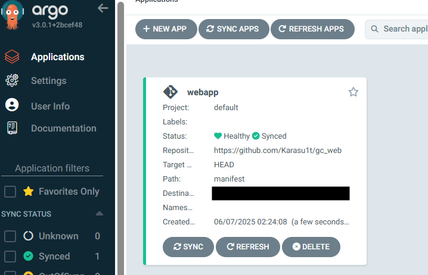

## フェーズ 4： GithubActions での CI 環境構築

### 概要

イメージに更新があった場合に、GithubActions により自動でビルドし、ArtifactRegistry に Push する  
また併せて deploy-web.yaml の Image の箇所を更新し、ArgoCD にて Deployment で管理する Pod を再デプロイしなおす CI/CD 環境を構築する

---

### 手順

#### 1. Github の Secret 追加

gc_web レポジトリ配下の Secret に以下を設定する

<pre><code>
GCP_CREDENTIALS: keys.jsonのファイル内容
PROJECT_ID: プロジェクト名
REGION: asia-northeast1
REPO_NAME: ArtifactRegistryのレポジトリ名
IMAGE_NAME: my-app
</code></pre>

#### 2. GithubActions 用の Workflow 用ファイルを作成する

<pre><code>
.
├── .github
│ └── workflows
│ └── deploy-image.yaml
└── src
├── Dockerfile
└── app.py
</code></pre>

      PROJECT_ID: your-gcp-project-id
      REGION: asia-northeast1
      REPO_NAME: my-repo
      IMAGE_NAME: my-app

#### 2. Github に Secret/Variables の設定追加

#### 3. Github 上に workflow を作成

#### 4. Github 上の src をアップデートし、ArtifactRegistry 上のイメージが更新されることのテスト

#### 5. Deployment で管理する Pod が再デプロイされることの確認
